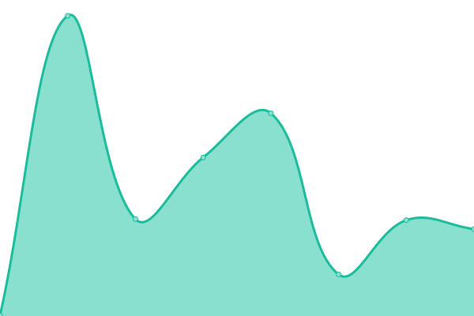
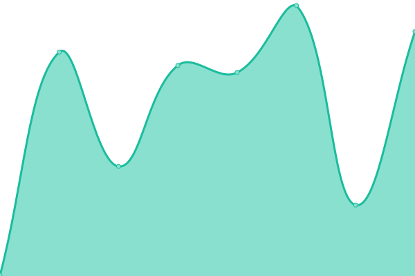
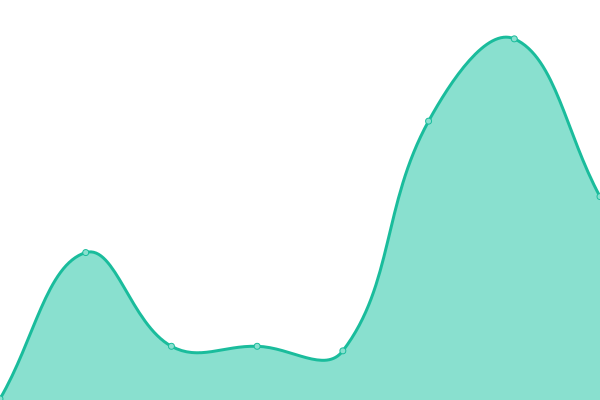
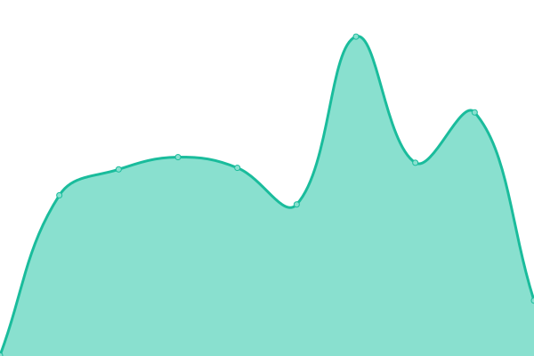

# [📈 Live Status](https://CondorGolf.github.io/uptime): <!--live status--> **🟩 All systems operational**

This repository contains the open-source uptime monitor and status page for [CondorGolf](https://CondorGolf.github.io/uptime), powered by [Upptime](https://github.com/upptime/upptime).

With [Upptime](https://upptime.js.org), you can get your own unlimited and free uptime monitor and status page, powered entirely by a GitHub repository. We use [Issues](https://github.com/CondorGolf/uptime/issues) as incident reports, [Actions](https://github.com/CondorGolf/uptime/actions) as uptime monitors, and [Pages](https://CondorGolf.github.io/uptime) for the status page.

<!--start: status pages-->
<!-- This summary is generated by Upptime (https://github.com/upptime/upptime) -->
<!-- Do not edit this manually, your changes will be overwritten -->
<!-- prettier-ignore -->
| URL | Status | History | Response Time | Uptime |
| --- | ------ | ------- | ------------- | ------ |
|  [Core Backend](https://api.condorgolf.ai/meta) | 🟩 Up | [core-backend.yml](https://github.com/CondorGolf/uptime/commits/HEAD/history/core-backend.yml) | 

 221ms
     
 | 

<a href="https://CondorGolf.github.io/uptime/history/core-backend">100.00%</a>
    

|  [Communication service](https://condor-communication-prod-3abb1d327c82.herokuapp.com/health) | 🟩 Up | [communication-service.yml](https://github.com/CondorGolf/uptime/commits/HEAD/history/communication-service.yml) | 

 189ms
     
 | 

<a href="https://CondorGolf.github.io/uptime/history/communication-service">100.00%</a>
    

|  [AI service](https://condor-ai-production-14b7337cf201.herokuapp.com/health) | 🟩 Up | [ai-service.yml](https://github.com/CondorGolf/uptime/commits/HEAD/history/ai-service.yml) | 

 200ms
     
 | 

<a href="https://CondorGolf.github.io/uptime/history/ai-service">100.00%</a>
    

|  [Web Applications](https://app.condorgolf.ai/) | 🟩 Up | [web-applications.yml](https://github.com/CondorGolf/uptime/commits/HEAD/history/web-applications.yml) | 

 229ms
     
 | 

<a href="https://CondorGolf.github.io/uptime/history/web-applications">100.00%</a>
    

<!--end: status pages-->

[**Visit our status website →**](https://CondorGolf.github.io/uptime)

## 📄 License

- Powered by: [Upptime](https://github.com/upptime/upptime)
- Code: [MIT](./LICENSE) © [Anand Chowdhary](https://anandchowdhary.com), supported by [Pabio](https://pabio.com)
- Data in the `./history` directory: [Open Database License](https://opendatacommons.org/licenses/odbl/1-0/)
